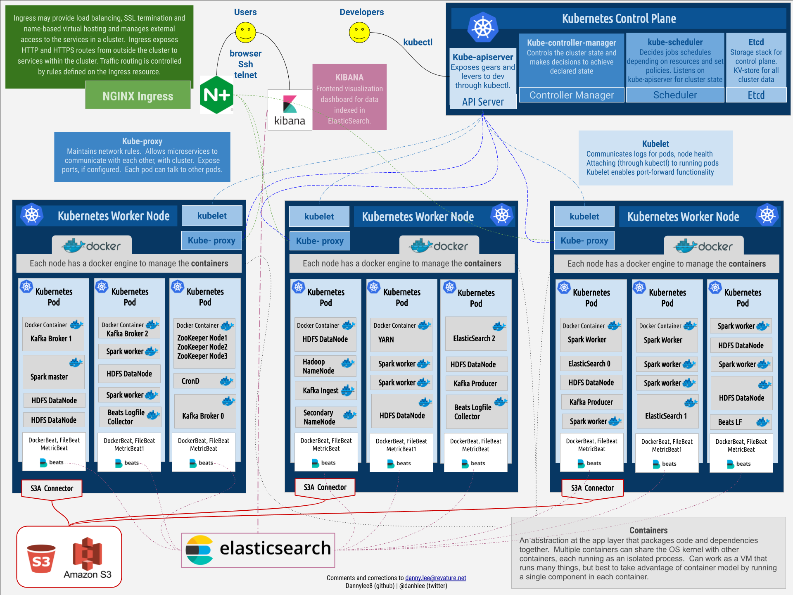

## Overview

This directory holds resources about the Kubernetes/Docker architecture.

## Resources

- An excellent overview of Docker and Kubernetes by James Quigley on [youtube](https://www.youtube.com/watch?v=1xo-0gCVhTU) (55:07)
- Hands on docker classroom (sandbox) [link](https://training.play-with-docker.com/)

--- 
## System Architecture (proposed)

